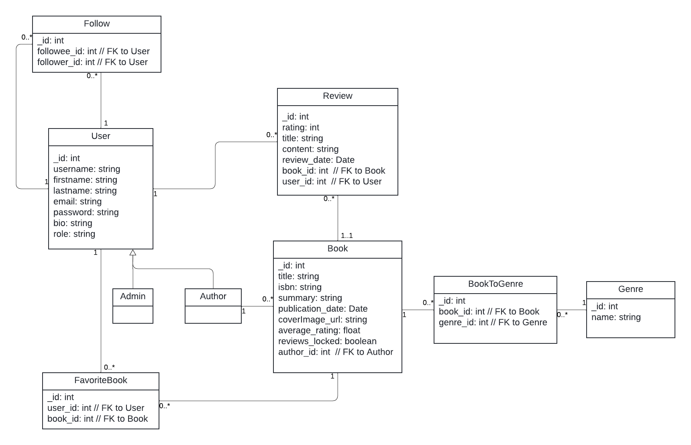

# Book Reviews Hub

A full-stack web application for discovering, reviewing, and discussing books.

## Live Demo & Backend

- Frontend: [https://social-network-react-web-app-xiaozhan.netlify.app](https://social-network-react-web-app-xiaozhan.netlify.app)
- Backend API: [https://social-network-node-server-app-xiaozhang.onrender.com](https://social-network-node-server-app-xiaozhang.onrender.com)

## 📊 Data Model

Below is the core data model illustrating entities and their relationships:



## 👥 User Roles & Sample Accounts

Three user types enable different capabilities:

| Role   | Username        | Password         |
| ------ | --------------- | ---------------- |
| Reader | `jane_doe`      | `jane123`        |
| Author | `jane_austen`   | `prideprejudice` |
| Admin  | `charlie_admin` | `charlieadmin`   |

Anyone can also **register a new account**.

## ✨ Key Features

- **Anonymous:** Browse home, view book details.
- **Reader:** Favorite books, follow users, write/edit reviews, view favorites.
- **Author:** All reader features, plus add/edit own books, lock/unlock reviews.
- **Admin:** All author features, plus view/manage all users, change roles, edit any book.

Across roles:

- User authentication (signup/signin/signout)
- Profile view & edit
- Follow/unfollow users
- Favorite/unfavorite books
- Search by genre & title, with pagination state retained

## 🚀 Getting Started

1. **Clone** the repo:

   ```bash
   git clone https://github.com/kathy-xxx/social-network-react-web-app-xiaozhang.git
   cd social-network-react-web-app-xiaozhang
   ```

2. **Install Dependencies** (frontend & backend):

   ```bash
   npm install
   ```

3. **Configure**

   - Create a `.env` in `/backend` with your MongoDB URI and port.
   - Create a `.env` in `/frontend` with `VITE_REMOTE_SERVER` pointing to backend URL.

4. **Run**

   - Backend: `node index.js`
   - Frontend: `npm run dev`

5. **Visit**
   - Frontend: `http://localhost:5173`
   - Backend: `http://localhost:4000`

## 🛠 Tech Stack

- **Frontend:** React, React Router, Redux Toolkit, React-Bootstrap
- **Backend:** Node.js, Express, MongoDB, Mongoose

## 📄 License

MIT © Your Name
